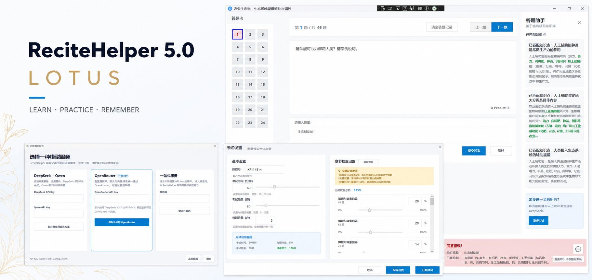

<p align="center">
  
</p>

<p align="center">
  <strong>简体中文</strong> · <a href="README_EN.md">English</a>
</p>

<h1 align="center">ReciteHelper</h1>

<p align="center">
  <strong>把课程资料变成真正可以练习、检索和复习的学习项目。</strong>
</p>

<p align="center">
  <a href="https://github.com/OpenRecite/ReciteHelper/actions/workflows/dotnet.yml"></a>
  <a href="LICENSE"></a>
  
  
  
</p>

<p align="center">
  <a href="https://github.com/OpenRecite/ReciteHelper/releases"><strong>下载 ReciteHelper</strong></a>
  · <a href="docs/manual-cn.md">用户手册</a>
  · <a href="https://github.com/OpenRecite/ReciteHelper/issues">问题反馈</a>
</p>

ReciteHelper 是一款面向考试复习、课程学习与知识整理的开源 Windows 桌面应用。它使用 AI 读取学习资料、提取知识点并生成题目，再通过本地知识库、智能判分、错题解析和 FSRS-6 个性化调度，形成从资料到长期记忆的完整学习闭环。

AI 在 ReciteHelper 中不是一个孤立的聊天框。它参与资料解析、题目生成、知识检索和错题辅助；章节、题库、学习记录与知识库则随项目文件一起保存在本地。

## 5.0 Lotus

5.0 版本围绕“从资料到掌握”重新整理了学习流程：

- **FSRS-6 科学复习**：根据难度、记忆稳定度和距上次复习的时间预测回忆概率，优先安排即将遗忘的题目；积累足够记录后可自动拟合个人参数。
- **五类题型**：选择、填空、判断、名词解释与解答题使用各自适合的交互和判分方式。
- **整卷导入与考试闭环**：从 PDF、TXT、HTML 或 MHTML 识别多套试卷，支持章节权重组卷、限时考试、自动评分和错题回顾。
- **项目级本地知识库**：为每个项目建立独立的文件型向量知识库，错题时检索相关知识点并按需生成 AI 解析。
- **更灵活的模型接入**：支持 DeepSeek + Qwen 直连、单 Key 的 OpenRouter，以及激活码托管服务三种方案。

## 工作流

```text
导入课程资料 → AI 提取知识与生成题目 → 练习 / 模拟考试
      → 错题检索与解析 → FSRS-6 安排下一次复习
```

## 界面预览

<table>
  <tr>
    <td width="62%">
      
      <br /><strong>答题与知识库助手</strong><br />练习、自动判分、相关知识点检索与按需 AI 解析集中在同一界面。
    </td>
    <td width="38%">
      
      <br /><strong>考试设置</strong><br />设置考试时长、题量、分值和章节权重。
    </td>
  </tr>
  <tr>
    <td>
      
      <br /><strong>知识点学习</strong><br />按章节浏览知识点并保存掌握进度。
    </td>
    <td>
      
      <br /><strong>考试回顾</strong><br />集中查看答案、解析与错题，并将错题归入学习项目。
    </td>
  </tr>
</table>

## 模型服务

首次启动且没有可用配置时，ReciteHelper 会显示模型服务选择窗口。

| 方案 | 需要准备 | 特点 |
| --- | --- | --- |
| DeepSeek + Qwen | DeepSeek Key 与 Qwen Key | 分别直连文本生成和向量服务，通常响应更快 |
| OpenRouter | 一个 OpenRouter Key | 配置简单；聊天和 embedding 统一调用，可能稍慢 |
| 一站式服务 | ReciteHelper 激活码 | 无需管理第三方 API Key，由服务端提供模型能力 |

API Key 默认保存在本机 `Config.xml`，也支持通过环境变量引用。使用 AI 功能时，相关文本会发送给你所选择的模型服务；项目文件与向量知识库仍保存在本地。

## 快速开始

1. 从 [Releases](https://github.com/OpenRecite/ReciteHelper/releases) 下载最新版本。
2. 解压后运行 `ReciteHelper.exe`。
3. 在首次启动窗口中选择一种模型服务并完成配置。
4. 导入文字型 PDF，或先将 DOCX、PPTX、PDF、TXT 等资料合并为 `.meg` 文件，然后创建 `.rhproj` 学习项目。

更完整的导入、配置与使用方法请阅读[中文用户手册](docs/manual-cn.md)。

## 从源码构建

需要 [.NET 10 SDK](https://dotnet.microsoft.com/download/dotnet/10.0) 以及支持 WPF 的 Visual Studio 或 JetBrains Rider。

```powershell
git clone --recurse-submodules https://github.com/OpenRecite/ReciteHelper.git
cd ReciteHelper
dotnet restore src/ReciteHelper.slnx
dotnet build src/ReciteHelper.slnx --configuration Release
dotnet run --project ReciteHelper.Wpf/ReciteHelper.Wpf.csproj
```

如果已经克隆但缺少子模块，请运行：

```powershell
git submodule update --init --recursive
```

## 文档

| 文档 | 内容 |
| --- | --- |
| [中文用户手册](docs/manual-cn.md) | 安装、配置与完整功能说明 |
| [English Manual](docs/manual-en.md) | English user guide |

## 参与贡献

Issue、功能建议、代码、测试和翻译都很欢迎：

1. Fork 仓库并从 `primary` 创建分支。
2. 保持现有代码风格，并为行为变化补充必要说明。
3. 提交前确认 Release 构建通过。
4. 发起 Pull Request，并关联相关 Issue 或附上界面截图。

参与前请阅读[行为准则](CODE_OF_CONDUCT.md)。讨论与反馈请前往 [Issues](https://github.com/OpenRecite/ReciteHelper/issues)，或发送邮件至 `arab@methodbox.top`。QQ 讨论群：`1053379975`。

## 许可证

ReciteHelper 采用 [GNU AGPL v3.0 或更高版本](LICENSE)发布。发布衍生作品或基于本项目提供网络服务时，请遵守许可证中的源码公开要求。

## 致谢

感谢 Sati、Mrwhite3142、oife、AcE77505 以及所有贡献者对文件处理、兼容性和稳定性改进提供的帮助。

<p align="center">
  
  &nbsp;&nbsp;&nbsp;
  
</p>

<p align="center">
  如果 ReciteHelper 对你有帮助，欢迎为项目点亮一个 Star。
</p>

[](https://www.star-history.com/#OpenRecite/ReciteHelper&type=date)
