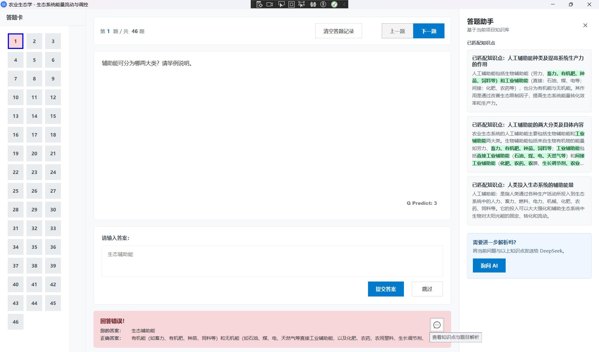

# ReciteHelper 用户手册

**版本号：v5-preview**

**更新日期：2026.06.28**

## 简介

ReciteHelper 是一款面向考试复习、课程学习与知识整理的 AI 桌面应用。它可以将学习资料转换为带有章节、知识点、多类型题目和本地知识库的 `.rhproj` 学习项目，并提供章节练习、智能复习、套卷导入、模拟考试和错题解析等功能。

软件会把题库、学习记录和知识库组织在项目目录中。知识库使用文件存储，不需要部署数据库或独立的向量服务。

手册中标记为“预览”的功能仍可能发生较大变化。

---

## 使用之前

### 配置 API Key

打开程序目录中的 `Config.xml`。推荐配置结构如下：

```xml
<Config>
    <Version>2</Version>

    <DeepSeekKey>%Environment.GetEnvironmentVariable("DSAPI")%</DeepSeekKey>
    <QwenKey>%Environment.GetEnvironmentVariable("QWEN_API_KEY")%</QwenKey>
    <MissingStrategy>Ignore</MissingStrategy>

    <OCRAccess></OCRAccess>
    <OCRSecret></OCRSecret>

    <PhonkOptions>
        <EnablePhonk>false</EnablePhonk>
        <WrongCount>3</WrongCount>
    </PhonkOptions>

    <RStandard>45</RStandard>
</Config>
```

- `DeepSeekKey`：创建项目时进行知识提取、题目生成和章节整理所必需；也用于按需生成错题解析。
- `QwenKey`：用于生成向量和查询项目知识库。未配置或请求失败时，项目仍会保留已生成的章节和题目，但不会提供知识库检索按钮。
- `MissingStrategy`：知识提取结果缺失时的处理策略。`Ignore` 优先保证速度；`Replay` 会尝试重新处理缺失内容，耗时和 API 消耗更高。
- `RStandard`：名词解释与解答题判定使用的相似度参数，通常不需要修改。
- `PhonkOptions`：彩蛋设置。启用 `EnablePhonk` 后，连续答错达到 `WrongCount` 次时会触发特殊效果。

可以直接把 Key 写入对应节点，也可以使用环境变量。推荐使用环境变量，避免 Key 以明文保存在配置文件中。例如：

```xml
<DeepSeekKey>%Environment.GetEnvironmentVariable("DEEPSEEK_API_KEY")%</DeepSeekKey>
<QwenKey>%Environment.GetEnvironmentVariable("QWEN_API_KEY")%</QwenKey>
```

配置文件中的 Key 仅用于调用对应服务，请不要提交到 Git 仓库或发送给他人。

---

## 经典复习项目

经典复习项目是 ReciteHelper 的主要项目类型，也是智能复习、模拟考试和游戏项目的数据来源。

在主界面点击“创建新的项目”，然后选择“经典复习项目”。


### 准备学习资料

创建窗口可以直接选择以下文件：

- 文字型 PDF，即能够选择和复制文字的 PDF。
- ReciteHelper 合并文件 `.meg`。

图片型或扫描版 PDF 暂时不能直接提取文字。处理多份资料，或使用 DOCX、PPTX、TXT 等格式时，请先在“文件合并”工具中将文件整理为 `.meg`。合并工具支持 DOCX、PPTX、PDF、TXT 和已有的 `.meg` 文件。


### 创建项目

填写项目名称、保存目录和复习资料路径，然后点击“确认创建”。创建窗口会实时显示以下阶段：

1. **读取文本**：读取 PDF 或 `.meg` 中的资料内容。
2. **知识提取**：分块调用 AI，生成知识点以及选择、填空、名词解释和解答题。判断题只从导入套卷中产生。
3. **文本聚类**：合并相似主题并整理章节与题目结构。
4. **向量生成**：构建项目级文件知识库，供后续错题检索使用。

这个过程可能持续较长时间，具体取决于资料长度、网络状态和 API 响应速度。请保持网络连接，不要重复点击创建按钮。

创建完成后，项目目录通常包含：

- `<项目名>.rhproj`：章节、题目、进度以及知识库文件引用。
- 知识库文件：与项目一起加载，用于向量检索。

请保留整个项目目录。只移动 `.rhproj` 而不移动其知识库文件，会导致知识库功能不可用。

### 加载项目

可以从最近项目列表打开项目，也可以选择“从已有项目加载”并打开 `.rhproj` 文件。项目加载时会同时读取章节、题目、学习记录和知识库；旧版不含知识库的 `.rhproj` 文件仍可用于普通练习。

---

## 知识点学习

打开项目后会进入章节选择窗口，其中显示章节数量、题目数量和各章节掌握度。


点击“学习知识点”可查看聚类后的章节和知识点。选择左侧章节，再选择具体知识点即可阅读内容；通过“标记为已掌握”可以更新掌握状态，取消勾选则恢复为未掌握。


---

## 题目练习

在章节选择窗口点击一个包含题目的章节，即可进入练习界面。


当前支持五种题型：

- **单项选择题**：直接在 A、B、C、D 选项中选择答案，然后提交。
- **填空题**：在与空位对应的横线上逐项填写答案，所有空均填写后才能提交。
- **判断题**：选择“正确”或“错误”。判断题仅来自导入套卷，不由学习项目生成流程创建。
- **名词解释**：填写术语定义，系统使用语义相似度判定。
- **解答题**：包括简答、论述、分析和计算等题型，使用较大的答题区域与语义相似度判定。

提交后会显示判定结果、用户答案和正确答案。答题结果会写入项目文件，并用于计算章节掌握度和安排智能复习。

### 错题助手与知识库

当答案错误且当前项目已加载可用知识库时，结果区域会显示答题助手按钮。点击后会打开侧边栏：

1. 使用题目和正确答案查询知识库中最相关的 3 个知识点。
2. 显示“已匹配知识点”及其原始内容。
3. 用绿色底色标记与题目、用户答案或正确答案高度重合的文本。
4. 由你决定是否继续询问 AI。只有点击确认后，题目、用户答案、正确答案和匹配知识点才会发送给 DeepSeek。
5. DeepSeek 返回针对本题的解释，指出答案问题并说明正确思路。




没有构建知识库、知识库文件为空或加载失败时，不会显示该按钮，不影响继续答题。

---

## 智能复习

在章节选择窗口的功能菜单中选择“智能复习”。软件会根据历史答题记录，从项目中筛选当前最值得复习的 30 道题。

ReciteHelper 使用基于 SuperMemo 思路并结合个人答题记录的复习参数。使用次数越多，可用于估计复习优先级的数据越充分。新项目或答题记录较少时，推荐结果的个性化程度也会较低。

---

## 模拟考试

在章节选择窗口点击“模拟考试”，进入考试设置页面。


可以配置课程号、考试时长、题目数量以及各章节抽题权重。权重总和不必手动调整为 100%，软件会自动换算比例。自动组卷的分值固定为：选择题 3 分、填空题每空 1 分、判断题 1 分、名词解释 4 分、解答题 5 分。

功能菜单中的“导入试卷”支持 PDF/TXT/HTML/MHTML。一个文件可以包含多套试卷，DeepSeek 会按套分割并生成答案与解析，结果保存在项目的 `exams` 目录。进入模拟考试后启用“加载套卷”，即可选择原卷；此时默认组卷参数会被禁用。导入套卷会优先沿用原卷中每大题或每小题给出的分值，无法识别时才使用默认题型分值。套卷 JSON 中的 `small_title` 和 `main_title` 可分别自定义试卷小标题与大标题。

确认考试规则后开始答题。交卷后可以查看得分和作答统计。


点击“查看答案”可以回顾每道题的作答、正确答案和现有解析，也可以将考试报告导出为文本文件。


---

## 导入与导出

在章节选择窗口打开功能菜单并选择导出，软件会在项目目录中生成 `rh_output.zip`。导出包包含项目文件、清单、可用的知识库文件以及 `exams` 套卷目录，适合备份或发送给其他用户。

导出副本会清除题目作答状态，不会修改当前正在使用的原项目。接收者可以在主界面使用导入功能打开该压缩包。

---

## 游戏项目（预览）

游戏项目以经典复习项目为数据来源。创建时选择一个现有 `.rhproj` 文件，软件会调用 AI 生成视觉小说所需的章节、剧情和脚本。


创建完成后，打开原经典复习项目，在章节选择窗口的功能菜单中点击“运行游戏”。


该功能仍处于预览阶段，生成时间和结果质量会受资料内容及模型响应影响。

---

## 常见问题（FAQ）

**Q：项目创建后没有章节或题目怎么办？**

A：确认 PDF 含有可选择的文字，并检查 DeepSeek Key 和网络连接。扫描版 PDF 请先进行 OCR，再转换为可读取的文本资料。

**Q：项目能够答题，但为什么没有知识库按钮？**

A：该按钮只在答错且项目知识库可用时出现。请确认创建项目时配置了 Qwen Key，并且项目目录中的知识库文件没有被移动、删除或清空。

**Q：为什么知识库查询仍需要联网？**

A：知识库数据保存在本地文件中，不需要部署数据库；查询文本仍需通过 Qwen 生成向量，因此需要网络和有效的 Qwen Key。

**Q：可以导入多份或非 PDF 资料吗？**

A：可以。先使用文件合并工具将 DOCX、PPTX、PDF、TXT 或其他 `.meg` 文件合并，再用生成的 `.meg` 创建项目。

**Q：导出会清除当前学习进度吗？**

A：不会。只有导出包中的副本会清除题目作答状态，原项目保持不变。

**Q：旧项目还能打开吗？**

A：可以。题型字段具有兼容读取策略；没有知识库的旧项目仍可学习和答题，只是不提供知识库检索。

---

## 更新日志

### v5-preview （2026.06.28）
- 新增错题知识检索、匹配内容高亮和按需 AI 解析。

### v4（2026.06.26）

- 支持单项选择题与简答题的独立生成、读取和交互。
- 创建项目时同步构建文件型知识库，并随项目加载、导入和导出。
- 新增四阶段项目创建进度窗口。
- 引入个性化智能复习和预设考试功能。

### v3（2026.01.14）

- 增加自定义考试功能。
- 引入重放策略以支持长 PDF。
- 支持多文件合并项目。
- 接入 AquaAvgFramework，支持创建游戏项目（预览）。

### v2（2025.11.25）

- 增加考试答案回顾。
- 增加知识点学习。
- 完善项目导出和文档。

### v1（2025.11.11）

- 支持 PDF 导入与知识点自动聚类。
- 增加模拟考试。
- 支持相似答案判定。

---

## 联系与反馈

- 项目主页：[GitHub 仓库](https://github.com/ArabidopsisDev/ReciteHelper)
- 反馈邮箱：arab@methodbox.top
- 用户交流群：1053379975
- 欢迎通过 Issue 或邮件提交建议、功能需求和问题反馈。
