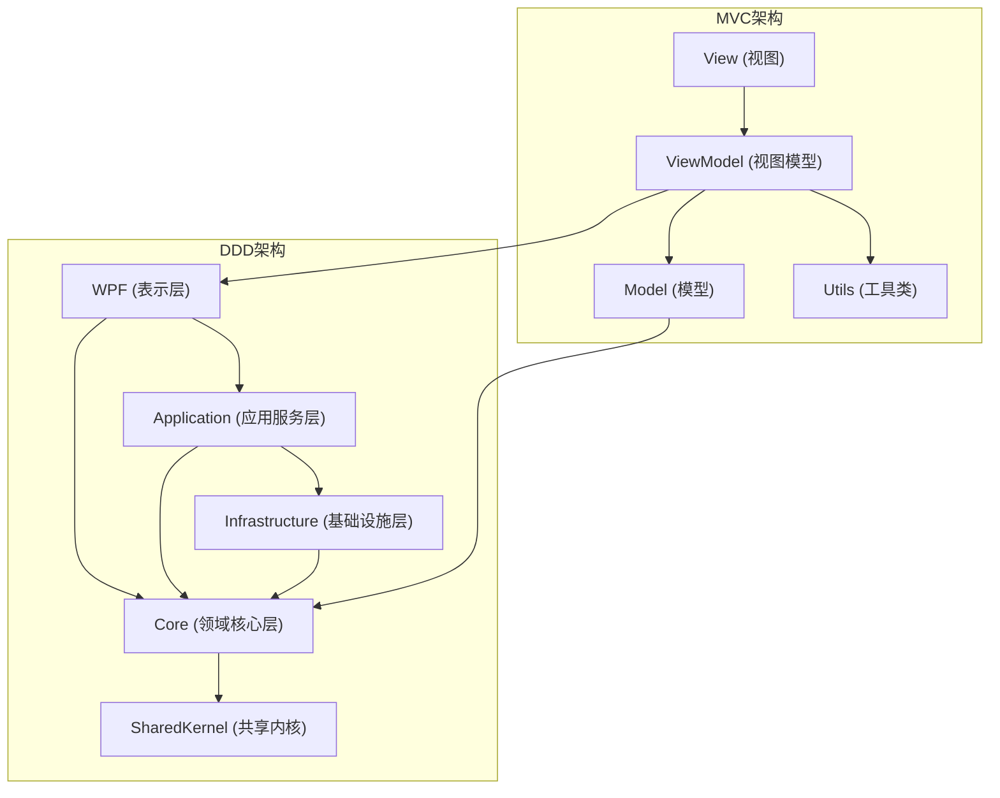

# 项目架构分析文档

## 1. 项目结构概览

### 1.1 整体目录结构

| 目录/文件 | 说明 | 架构类型 |
|----------|------|---------|
| `src/` | 旧的 MVC 架构代码 | MVC |
| `ReciteHelper.Core/` | 领域核心层 | DDD |
| `ReciteHelper.Application/` | 应用服务层 | DDD |
| `ReciteHelper.Infrastructure/` | 基础设施层 | DDD |
| `ReciteHelper.SharedKernel/` | 共享内核 | DDD |
| `ReciteHelper.Wpf/` | WPF 表示层 | DDD |
| `external/` | 外部依赖 | 通用 |
| `model_training/` | 模型训练代码 | 通用 |

### 1.2 核心组件关系



## 2. 旧 MVC 架构分析

### 2.1 架构组成

#### 2.1.1 Model 层 (`src/Model/`)

- **职责**：包含应用程序的数据模型，主要用于数据的存储和业务逻辑
- **核心文件**：
  - `Project.cs` - 项目模型
  - `Chapter.cs` - 章节模型
  - `Config.cs` - 配置模型
  - `ProjectType.cs` - 项目类型枚举

- **特点**：
  - 直接使用公共属性进行数据访问
  - 包含简单的业务逻辑方法（如 `ExportQuestions()`）
  - 与 DDD 架构中的实体有一定重叠

#### 2.1.2 View 层 (`src/View/`)

- **职责**：负责用户界面的展示
- **核心文件**：
  - `MainWindow.xaml` - 主窗口
  - `CreateProjectWindow.xaml` - 创建项目窗口
  - `QuizWindow.xaml` - 测验窗口
  - `ExamWindow.xaml` - 考试窗口

- **特点**：
  - 使用 WPF XAML 实现界面
  - 代码-behind 文件包含 UI 逻辑
  - 直接与 ViewModel 交互

#### 2.1.3 ViewModel 层 (`src/ViewModel/`)

- **职责**：连接 View 和 Model，处理业务逻辑和数据绑定
- **核心文件**：
  - `ChapterViewModel.cs` - 章节视图模型
  - `QuestionItem.cs` - 问题项
  - `ReviewItemViewModel.cs` - 复习项视图模型

- **特点**：
  - 实现 `INotifyPropertyChanged` 接口
  - 包含数据绑定属性
  - 处理 UI 相关的业务逻辑

#### 2.1.4 Utils 层 (`src/Utils/`)

- **职责**：提供通用工具和辅助方法
- **核心文件**：
  - `JudgeAnswer.cs` - 答案判断
  - `Supermemo.cs` - 超级记忆算法
  - `ExtractText.cs` - 文本提取
  - `OCRProvider.cs` - OCR 提供者

- **特点**：
  - 包含各种辅助功能
  - 与业务逻辑耦合度较高
  - 缺乏明确的接口定义

### 2.2 架构优缺点

#### 优点

- **简单直观**：结构清晰，易于理解
- **开发速度快**：适合小型应用
- **直接数据绑定**：WPF 数据绑定机制工作良好

#### 缺点

- **业务逻辑分散**：业务逻辑分布在 Model、ViewModel 和 Utils 中
- **可测试性差**：缺乏接口抽象，难以进行单元测试
- **扩展性有限**：随着业务复杂度增加，代码会变得难以维护
- **领域模型不清晰**：缺乏明确的领域边界和聚合根概念

## 3. 新 DDD 架构分析

### 3.1 架构组成

#### 3.1.1 领域核心层 (`ReciteHelper.Core/`)

- **职责**：包含领域模型、实体、值对象和领域服务
- **核心组件**：
  - **Aggregates** - 聚合根（如 `Project`）
  - **Entities** - 实体（如 `Chapter`、`Question`）
  - **ValueObjects** - 值对象（如 `KnowledgePoint`、`ExamSettings`）
  - **Enums** - 枚举类型
  - **Exceptions** - 领域异常
  - **Interfaces** - 领域服务接口

- **特点**：
  - 基于 `AggregateRoot`、`Entity`、`ValueObject` 基类
  - 包含领域特定的业务规则
  - 与基础设施和表示层解耦

#### 3.1.2 应用服务层 (`ReciteHelper.Application/`)

- **职责**：协调领域对象完成用例，处理应用逻辑
- **核心组件**：
  - **DTOs** - 数据传输对象
  - **Interfaces** - 应用服务接口
  - **Services** - 应用服务实现

- **特点**：
  - 作为领域层和表示层之间的桥梁
  - 处理跨聚合的业务逻辑
  - 负责事务管理和用例协调

#### 3.1.3 基础设施层 (`ReciteHelper.Infrastructure/`)

- **职责**：提供技术实现，如数据访问、外部服务集成
- **核心组件**：
  - **Algorithms** - 算法实现
  - **Configuration** - 配置服务
  - **Services** - 基础设施服务

- **特点**：
  - 实现领域层定义的接口
  - 处理技术细节（如文件操作、API 调用）
  - 与外部系统集成

#### 3.1.4 表示层 (`ReciteHelper.Wpf/`)

- **职责**：负责用户界面和用户交互
- **核心组件**：
  - **ViewModels** - 视图模型
  - **Views** - 视图
  - **Services** - 表示层服务

- **特点**：
  - 使用 MVVM 模式
  - 与应用服务层交互
  - 处理 UI 逻辑和用户体验

#### 3.1.5 共享内核 (`ReciteHelper.SharedKernel/`)

- **职责**：提供跨层共享的基础组件
- **核心组件**：
  - **AggregateRoot.cs** - 聚合根基类
  - **Entity.cs** - 实体基类
  - **ValueObject.cs** - 值对象基类
  - **Result** - 操作结果

- **特点**：
  - 提供领域模型的基础结构
  - 包含通用的领域概念
  - 被其他层引用

### 3.2 架构优缺点

#### 优点

- **领域模型清晰**：明确的领域边界和聚合根
- **高内聚低耦合**：各层职责明确，依赖关系清晰
- **可测试性强**：通过接口抽象，易于进行单元测试
- **扩展性好**：领域模型可以独立演化
- **业务逻辑集中**：核心业务逻辑集中在领域层

#### 缺点

- **复杂度增加**：需要更多的代码和抽象
- **学习曲线较陡**：DDD 概念需要一定的学习成本
- **初期开发速度较慢**：需要更多的设计和规划

## 4. 架构迁移分析

### 4.1 迁移现状

- **部分完成**：已经实现了 DDD 架构的核心组件
- **混合使用**：旧的 MVC 代码和新的 DDD 代码同时存在
- **依赖关系**：MVC 代码正在逐步依赖 DDD 组件

### 4.2 迁移策略

1. **领域模型优先**：
   - 首先构建核心领域模型
   - 定义聚合根、实体和值对象
   - 实现领域服务接口

2. **应用服务层**：
   - 实现应用服务
   - 协调领域对象完成用例
   - 提供给表示层使用

3. **基础设施层**：
   - 实现技术细节
   - 提供具体的服务实现

4. **表示层迁移**：
   - 逐步将 MVC 的 ViewModel 迁移到 DDD 的表示层
   - 调整 UI 逻辑以使用新的应用服务

### 4.3 关键差异对比

| 对比项 | MVC 架构 | DDD 架构 |
|-------|---------|---------|
| 核心概念 | Model, View, ViewModel | Aggregate, Entity, ValueObject, Domain Service |
| 业务逻辑位置 | 分散在多个层 | 集中在领域层 |
| 数据访问 | 直接访问属性 | 通过领域方法 |
| 依赖方向 | 双向依赖 | 单向依赖（从外到内） |
| 测试策略 | 难以单元测试 | 易于单元测试 |
| 扩展性 | 有限 | 良好 |
| 代码组织 | 按技术职责 | 按领域边界 |

### 4.4 迁移示例

#### 从 MVC 到 DDD 的迁移示例

**MVC 中的 Project 模型：**
```csharp
public class ProjectEX
{
    public string? ProjectName { get; set; }
    public string? StoragePath { get; set; }
    public string? QuestionBankPath { get; set; }
    public List<Chapter>? Chapters { get; set; }
    public DateTime LastAccessed { get; set; }

    public List<Question> ExportQuestions()
    {
        List<Question> questions = [];
        foreach (var chapter in Chapters!)
            questions.AddRange(chapter.Questions!);
        return questions;
    }
}
```

**DDD 中的 Project 聚合根：**
```csharp
public class Project : AggregateRoot
{
    public string? ProjectName { get; set; }
    public string? StoragePath { get; set; }
    public string? QuestionBankPath { get; set; }
    public List<Chapter>? Chapters { get; set; }
    public DateTime LastAccessed { get; private set; }

    public List<Question> ExportQuestions()
    {
        List<Question> questions = [];
        foreach (var chapter in Chapters!)
            questions.AddRange(chapter.Questions!);
        return questions;
    }

    public void UpdateLastAccessed()
    {
        LastAccessed = DateTime.Now;
    }
}
```

**主要变化：**
1. 继承自 `AggregateRoot` 基类
2. `LastAccessed` 属性设置为私有 setter
3. 添加了 `UpdateLastAccessed()` 方法，封装了修改逻辑
4. 领域行为更加明确

## 5. 结论与建议

### 5.1 迁移评估

- **迁移进度**：已完成核心领域模型的构建，正在进行表示层的迁移
- **技术债务**：旧的 MVC 代码与新的 DDD 代码并存，需要逐步重构
- **架构优势**：DDD 架构在可维护性、可测试性和扩展性方面具有明显优势

### 5.2 建议

1. **继续完成迁移**：
   - 优先迁移核心业务逻辑到 DDD 架构
   - 逐步淘汰旧的 MVC 代码
   - 确保新代码遵循 DDD 原则

2. **加强领域模型**：
   - 进一步明确领域边界
   - 完善聚合根和实体的设计
   - 确保领域服务的职责清晰

3. **改进测试策略**：
   - 为领域层编写单元测试
   - 为应用服务编写集成测试
   - 确保测试覆盖率

4. **文档完善**：
   - 编写领域模型文档
   - 记录架构决策过程
   - 建立代码规范和最佳实践

5. **团队培训**：
   - 组织 DDD 相关培训
   - 建立代码审查机制
   - 确保团队成员理解 DDD 概念

### 5.3 未来展望

- **完全迁移到 DDD**：最终实现完全的 DDD 架构
- **微服务潜力**：基于 DDD 架构，未来可以考虑微服务拆分
- **领域驱动设计的持续演进**：根据业务需求不断完善领域模型

## 6. 架构演进路线图

| 阶段 | 目标 | 关键任务 |
|------|------|--------|
| 阶段 1 | 核心领域模型构建 | 定义聚合根、实体、值对象 |
| 阶段 2 | 应用服务层实现 | 实现应用服务，协调领域对象 |
| 阶段 3 | 基础设施层实现 | 提供技术实现，如数据访问 |
| 阶段 4 | 表示层迁移 | 将 MVC 的 ViewModel 迁移到 DDD 表示层 |
| 阶段 5 | 旧代码清理 | 逐步淘汰旧的 MVC 代码 |
| 阶段 6 | 测试与优化 | 完善测试，优化架构 |

通过本次架构迁移，项目将获得更好的可维护性、可扩展性和可测试性，为未来的业务发展奠定坚实的技术基础。